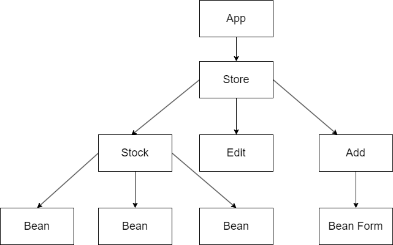

# Local Business Inventory Tracker

#### A React App that tracks inventory for a local business

#### By Kiernan beattie

## Technologies Used

* _React_
* _Html_
* _WebPack_
* _Vscode_

##  Description

 A simple example site to track products in a store

## Setup/Installation Requirements

1 _Clone this repo_
2 _Open a console or terminal_
3 _Move to the repos new directory_
4 _Enter npm install_
5 _Enter npm run start_
6 _The program should appear in your default browser_
  * _If it doesn't try entering the URL "http://localhost:8080"_

## Known Bugs

* _N/a_

## License

* MIT _2024_

## Contact Information

* Kiernan1994@gmail.com